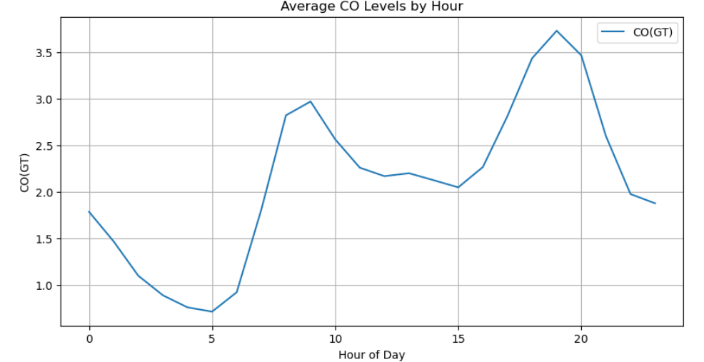
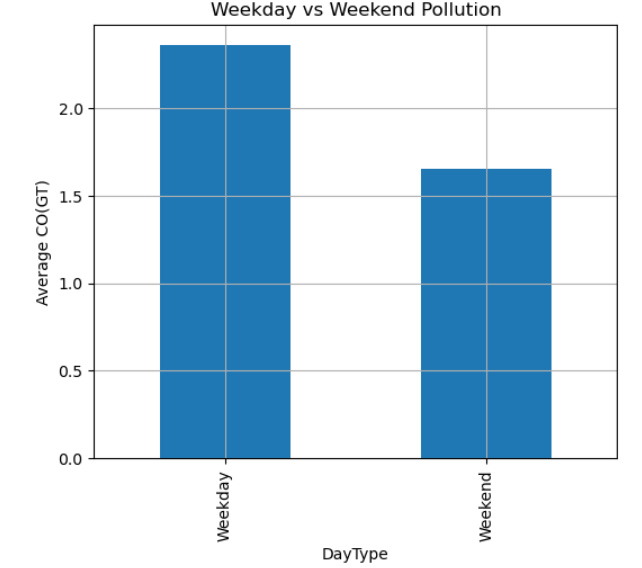
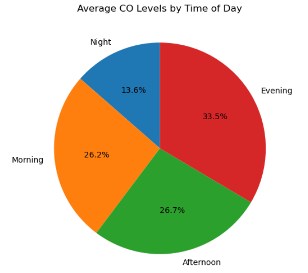
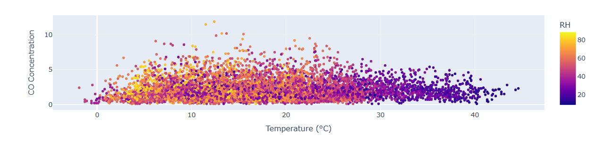
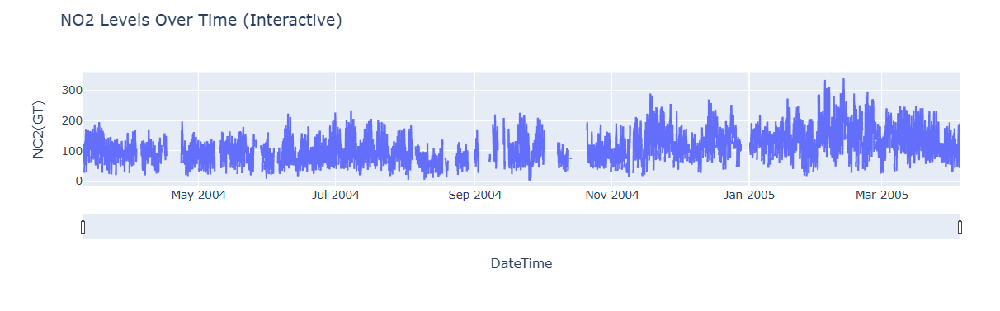
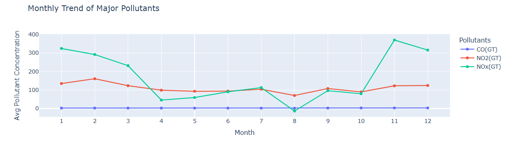

## Air Quality Trend Analysis

### Overview
An in-depth analysis of the UCI Air Quality dataset to identify 
pollution patterns across time, weather conditions, and seasonal 
trends. Focused on CO, NO2, and NOx pollutants and their 
relationship with human activity and weather.

### Tools Used
Python, Pandas, Plotly, Seaborn

### Key Findings & Objectives

**1. CO Levels Throughout the Day**
- CO levels are lowest in early morning (4–5 AM) when 
  traffic is minimal
- Pollution peaks twice — morning rush hour (9 AM) and 
  evening rush hour (7 PM)
- Confirms traffic as the primary driver of CO pollution

**2. Weekdays vs Weekends**
- CO pollution is significantly higher on weekdays than weekends
- Indicates human activity and industrial traffic are the 
  main contributors to air pollution
- Weekend reduction confirms behavioural impact on air quality

**3. Time-Based Air Quality Analysis**
- CO levels are lowest at night
- Evening records the highest CO levels due to rush hour traffic
- Morning and afternoon also show elevated levels due to 
  daily commuting and activities

**4. Weather Impact on Air Pollution**
- CO concentration is highest at moderate temperatures (10°C–20°C) 
  combined with high humidity
- As temperature rises above 30°C, CO levels drop to their lowest
- High humidity and moderate temperatures are the most common 
  conditions for elevated CO levels

**5. Seasonal NO2 and NOx Trends**
- Highest pollution spikes occur November 2004 – February 2005
- NOx and NO2 levels are significantly higher than CO year-round
- Pollution peaks in winter months (Jan, Dec) and drops 
  mid-year (Apr–Aug)
- Cold months cause worse air quality due to increased fuel 
  burning and lower atmospheric dispersion
### Charts

**1. CO Levels Throughout the Day**

**2. Weekday vs Weekend Pollution**

**3. Time-Based Air Quality**

**4. Weather Impact on CO**

**5. NO2 Seasonal Trends**

**NO2 and NOX levells**

### Dataset
Kaggle Air Quality Dataset
